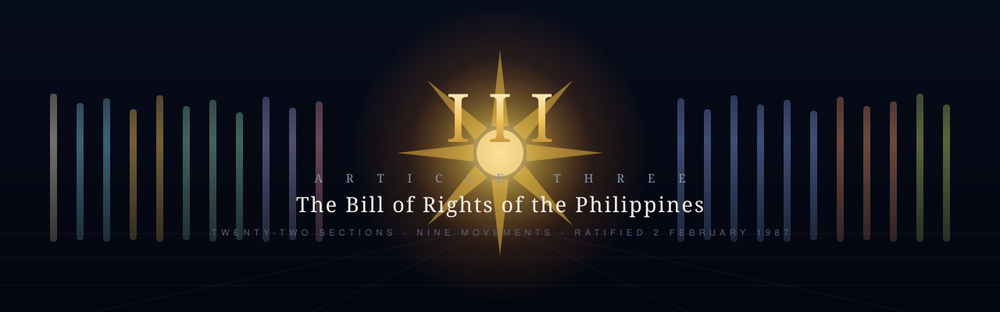

<div align="center">



<br>

[](https://hatimhtm.github.io/article-iii/)
[](#-stack)
[](#-local)
[](LICENSE)

*An interactive, motion-driven reading of Article III of the 1987 Constitution of the Republic of the Philippines — all twenty-two sections, verbatim, with the doctrines, landmark cases and martial-law history that produced each one.*

**[→ Open the experience](https://hatimhtm.github.io/article-iii/)**

</div>

---

### `/// BRIEF`

Article III is usually met as a wall of text. This is the same article, walked.

You travel a colonnade in deep space. Each of the twenty-two sections is a shaft of stone and light; the height of the lit band on each shaft tells you where that section sits in the article, so the whole thing reads as a rising scale as you move through it. At the far end, an eight-rayed sun. When you reach it, the colonnade folds inward and the twenty-two shafts become its rays.

The scene is not decoration. Its structure carries the article's structure.

### `/// SECTIONS`

The twenty-two sections keep their constitutional order, grouped into nine movements as a reading aid:

| Movement | Sections | |
|---|---|---|
| The Foundation | §1 | Due process, equal protection |
| Security of the Person | §2 – §3 | Searches, seizures, privacy, the exclusionary rule |
| Voice & Conscience | §4 – §5 | Speech, press, assembly, petition, religion |
| Movement, Knowledge, Association | §6 – §8 | Abode, travel, information, unions |
| Property & Obligation | §9 – §10 | Just compensation, non-impairment |
| Access to Justice | §11 | Free access to the courts |
| The Rights of the Accused | §12 – §17 | Custodial rights, bail, fair trial, habeas corpus, speedy disposition, self-incrimination |
| Human Dignity | §18 – §20 | Political belief, servitude, cruel punishment, debt |
| Finality & Fair Warning | §21 – §22 | Double jeopardy, ex post facto, bills of attainder |

### `/// WHAT EACH SECTION CARRIES`

- **The text, verbatim** — cross-checked against three independent transcriptions
- **In plain words** — what it actually does, in ordinary English
- **Why it exists** — the drafting history, and what the 1986 Commission was answering
- **Doctrines** — the named tests and rules a student is expected to know
- **Landmark cases** — two to five per section, with the holding in one line
- **In real life** — a concrete Philippine scenario the section decides
- **The limits** — where the right stops, which is where most exam questions live

### `/// ALSO IN HERE`

- A **prologue**: 1972 to 1987, because §12 does not make sense without it
- A **map** of all twenty-two sections, with full-text search across every doctrine and case note
- A **recall test**: fifteen scenarios, name the section each one turns on
- Deep links — `#s12` opens Section 12 directly
- Keyboard navigation: `←` `→` step, `1`–`9` jump, `M` map, `T` test
- A reduce-motion toggle, honoured alongside `prefers-reduced-motion`
- Optional ambient sound, synthesised at runtime — no audio files

### `/// SOURCES`

The constitutional text was taken from three sources and reconciled character by character:

- [ChanRobles Virtual Law Library](https://chanrobles.com/article3.htm)
- [The LawPhil Project](https://lawphil.net/consti/cons1987.html)
- [University of Minnesota Human Rights Library](https://hrlibrary.umn.edu/research/Philippines/PHILIPPINE%20CONSTITUTION.pdf)

Where the three agree on wording that reads oddly — §12(4)'s *"compensation to the rehabilitation of victims"* — the ratified text is reproduced as it stands, with a note in the panel.

Commentary, doctrine summaries and case notes are study aids. They are not legal advice, and they are no substitute for reading the reports.

### `/// STACK`

- **Vanilla ES modules.** No framework, no bundler, no build step.
- **Three.js r180**, vendored into `vendor/` behind an import map — nothing is fetched from a CDN at runtime.
- **Hand-written GLSL** for every surface: the plasma core, the twenty-four ray blades, the faceted shafts, the tiling dust field, the survey grid, and the final grade (vignette, chromatic aberration, film grain).
- `EffectComposer` + `UnrealBloomPass` for the bloom, then a custom grade pass.
- Quality tiers off `deviceMemory` / `hardwareConcurrency`; pixel ratio capped well below retina, because the look is soft and the frames are cheaper that way.
- Graceful degradation: if WebGL fails to initialise, the reading layer still works.

### `/// LAYOUT`

```
index.html            import map + the four layers (canvas, stage, hud, overlays)
css/main.css          design system, layout, responsive, reduced motion
js/
  main.js             bootstrap, input, resize, the frame loop
  core/
    state.js          journey layout in screen-heights, phase maths, quality tiers
    scroll.js         virtual scroll, smoothing, jumps
    util.js           easing, damping, small DOM helpers
  data/
    sections.js       the 22 sections — verbatim text and all commentary
    clusters.js       the nine movements and their palettes
    prologue.js       1972–1987
    quiz.js           15 recall scenarios
  scene/
    layout.js         camera spline, shaft placement, epilogue choreography
    world.js          assembly, per-frame mood, focus, grade
    sun.js            plasma core, 24 ray blades, halo, three stars
    monoliths.js      the 22 shafts and the decorative counter-row
    particles.js      starfield + camera-tiling dust
    ground.js         the survey grid
    post.js           bloom + final grade
    glsl.js           shared noise and haze
  ui/
    reader.js         hero, prologue, the section panel, the epilogue
    hud.js            wordmark, rail, position, tools
    overlays.js       map + recall test
    audio.js          synthesised ambience
vendor/               Three.js r180 + the postprocessing addons
```

### `/// LOCAL`

There is no build. Any static server will do:

```bash
python3 -m http.server 8000
# → http://localhost:8000
```

Opening `index.html` from the filesystem will not work — ES modules and the import map need a real origin.

### `/// STATUS`

Live at **[hatimhtm.github.io/article-iii](https://hatimhtm.github.io/article-iii/)**. Deployed from `main` by GitHub Actions.

---

<div align="center">
<sub>Built for a political science student.</sub>
</div>
